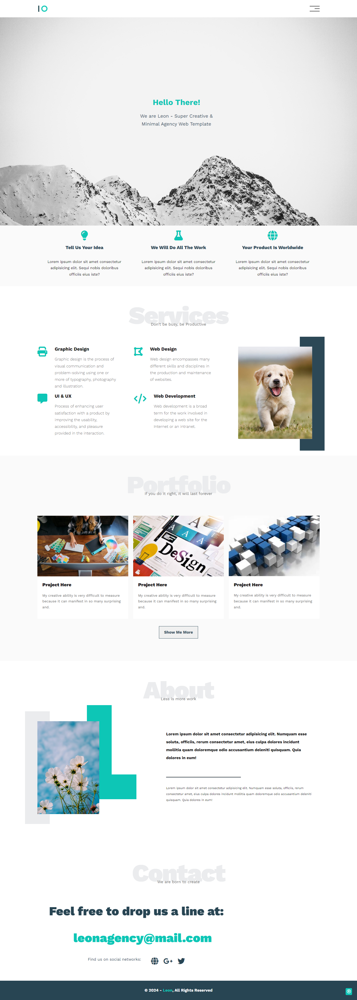

# Leon - PSD Agency Template

This is coding for the free [Leon - PSD Agency Template on Graphberry.com](https://www.graphberry.com/item/leon-psd-agency-template). 

## Table of contents

- [Overview](#overview)
  - [The template](#the-template)
  - [Screenshot](#screenshot)
  - [Links](#links)
- [My process](#my-process)
  - [Built with](#built-with)
  - [What I learned](#what-i-learned)
  - [Continued development](#continued-development)
- [Author](#author)

## Overview

### The template

Leon is a free PSD template made by Graphberry. It comes in a modern, flat design with vibrant colors. This landing page is great for representing your portfolio or other types of websites. Free Google font used, the link is in "help" file

### Screenshot

### Links

- Repo URL: [Repo URL](https://github.com/YahiaG/Leon---PSD-Agency-Template)
- Live Site URL: [Live Site URL]()

## My process

### Built with

- Semantic HTML5 markup
- CSS custom properties
- Flexbox
- CSS Grid
- Mobile-first workflow

## Author

- Frontend Mentor - [@Yahia Ali](https://www.frontendmentor.io/profile/YahiaG)
- LinkedIn - [Yahia Ali](https://www.linkedin.com/in/Yahia-Ali22)

## Acknowledgments

If I should tip my hat for someone in this field, this one will absolutely be [Osama Elzero(https://elzero.org/)], I'm so grateful to him for all the Good courses he presents to all for free.

> من علمني حرفاً صنت له عهداً, حفظت له وداً